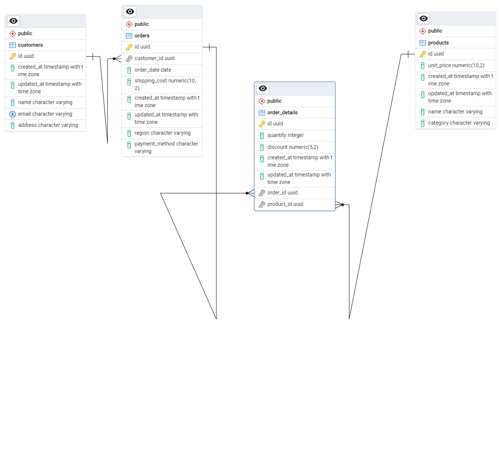

## Description

[Nest](https://github.com/nestjs/nest) framework TypeScript starter repository.


# Revenue Calculation API

This project is a NestJS application designed to ingest large CSV files of sales data into a PostgreSQL database and perform revenue calculations. It supports revenue calculation by Product, Category, Region, and overall total.

## ER Diagram



## Prerequisites

* Node.js (>= 20.x)
* PostgreSQL (>= 13)

## Getting Started

### 1. Clone the repository:

```bash
$ git clone <repository-url>
$ cd <repository-name>
```

### 2. Install dependencies:

```bash
$ npm install
```

### 4. Start the application:

```bash
$ npm run start:dev
```

The application will be running at `http://localhost:3000`

## Database Schema

Here are the main tables and their creation commands:

### Customers

```sql
CREATE TABLE customers (
    id UUID PRIMARY KEY DEFAULT gen_random_uuid(),
    name VARCHAR(255),
    email VARCHAR(255) UNIQUE,
    address TEXT,
    created_at TIMESTAMP DEFAULT NOW(),
    updated_at TIMESTAMP DEFAULT NOW()
);
```

### Products

```sql
CREATE TABLE products (
    id UUID PRIMARY KEY DEFAULT gen_random_uuid(),
    name VARCHAR(255),
    category VARCHAR(255),
    unit_price NUMERIC(10, 2),
    created_at TIMESTAMP DEFAULT NOW(),
    updated_at TIMESTAMP DEFAULT NOW()
);
```

### Orders

```sql
CREATE TABLE orders (
    id UUID PRIMARY KEY DEFAULT gen_random_uuid(),
    customer_id UUID REFERENCES customers(id),
    order_date TIMESTAMP,
    region VARCHAR(255),
    payment_method VARCHAR(255),
    shipping_cost NUMERIC(10, 2),
    created_at TIMESTAMP DEFAULT NOW(),
    updated_at TIMESTAMP DEFAULT NOW()
);
```

### OrderDetails

```sql
CREATE TABLE order_details (
    id UUID PRIMARY KEY DEFAULT gen_random_uuid(),
    order_id UUID REFERENCES orders(id),
    product_id UUID REFERENCES products(id),
    quantity INT,
    discount NUMERIC(5, 2),
    created_at TIMESTAMP DEFAULT NOW(),
    updated_at TIMESTAMP DEFAULT NOW()
);
```

## API Endpoints

* **POST** `/csv/upload`: Upload a CSV file to ingest data.
* **GET** `/analysis/revenue`: Calculate revenue based on query params (`type`, `startDate`, `endDate`).

## Running Tests

```bash
$ npm run test
```

## Linting and Formatting

```bash
$ npm run lint
$ npm run format
```

## Contributing

Feel free to open issues or create pull requests. Contributions are welcome!

## License

MIT License
